# QDM: Quadtree-Based Region-Adaptive Sparse Diffusion Models for Efficient Image Super-Resolution

[Arxiv](https://arxiv.org/abs/2503.12015)

 [](https://github.com/linYDTHU/QDM)


If you've found QDM useful for your research or projects, please show your support by ⭐ in this repo. Thanks!

---
>Deep learning-based super-resolution (SR) methods often perform pixel-wise computations uniformly across entire images, even in homogeneous regions where high-resolution refinement is redundant. 
We propose the Quadtree Diffusion Model (QDM), a region-adaptive diffusion framework that leverages a quadtree structure to selectively enhance detail-rich regions while reducing computations in homogeneous areas.
By guiding the diffusion with a quadtree derived from the low-quality input, QDM identifies key regions—represented by leaf nodes—where fine detail is essential and applies minimal refinement elsewhere.
This mask-guided, two-stream architecture adaptively balances quality and efficiency, producing high-fidelity outputs with low computational redundancy.
Experiments demonstrate QDM’s effectiveness in high-resolution SR tasks across diverse image types, particularly in medical imaging (e.g., CT scans), where large homogeneous regions are prevalent.
Furthermore, QDM outperforms or is comparable to state-of-the-art SR methods on standard benchmarks while significantly reducing computational costs, highlighting its efficiency and suitability for resource-limited environments.
>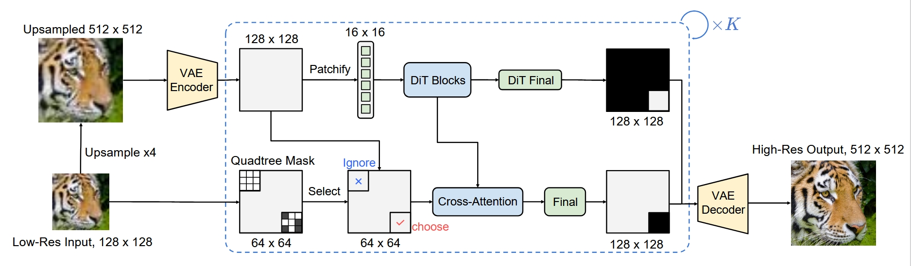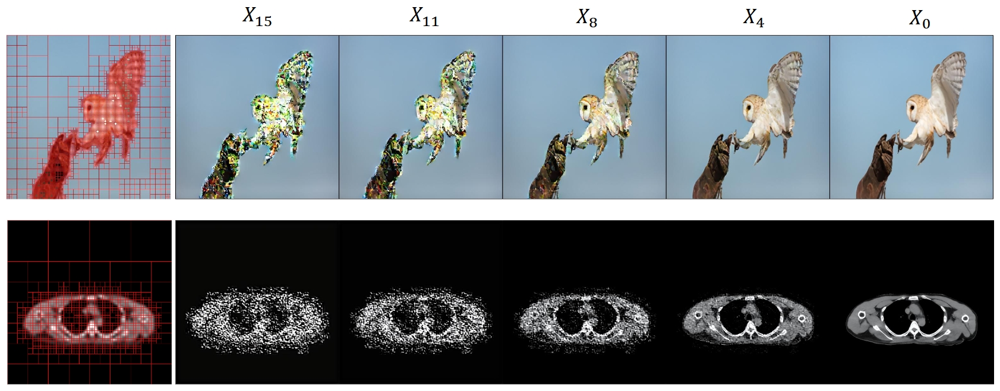

---
## Update
- **2025.03.18**: Release codes.
- **2025.03.14**: Create this repo.

## Requirements
* More detail (See [requirements.txt](requirements.txt))
A suitable [conda](https://conda.io/) environment named `quadtree_diffusion` can be created and activated with:

```
conda create -n quadtree_diffusion python=3.10
conda activate quadtree_diffusion
pip install -r requirements.txt
```

## Examples
### Real-World Image Super-Resolution
[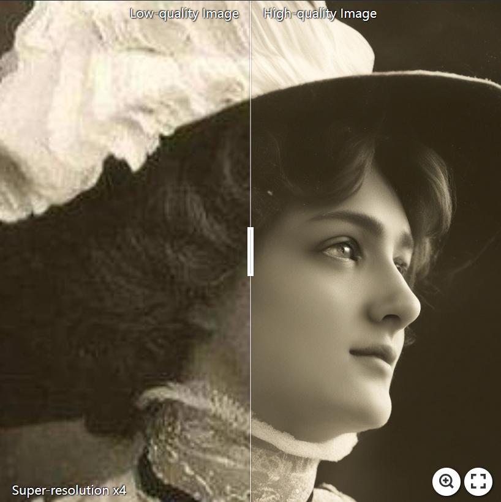](https://imgsli.com/MzQ5ODk4) [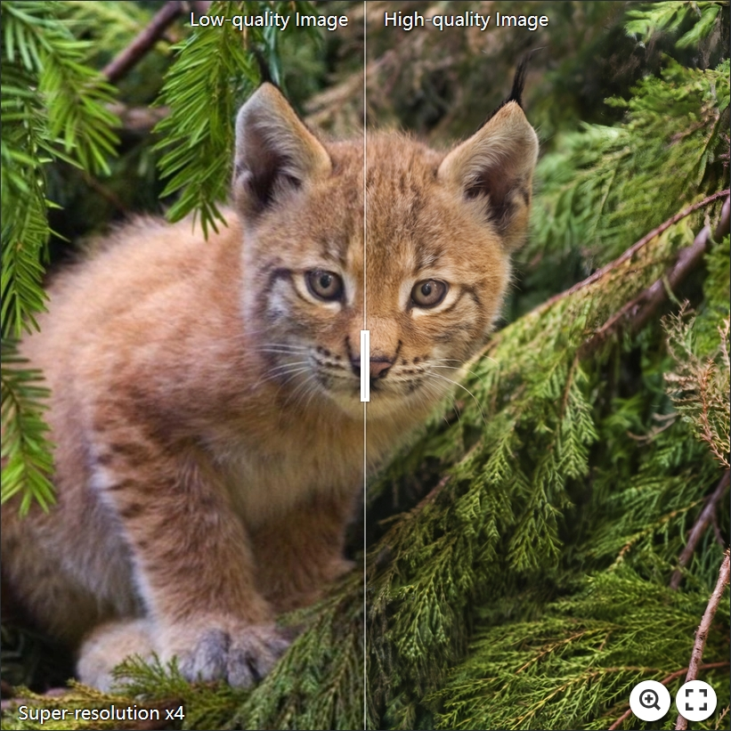](https://imgsli.com/MzUxMTc0) [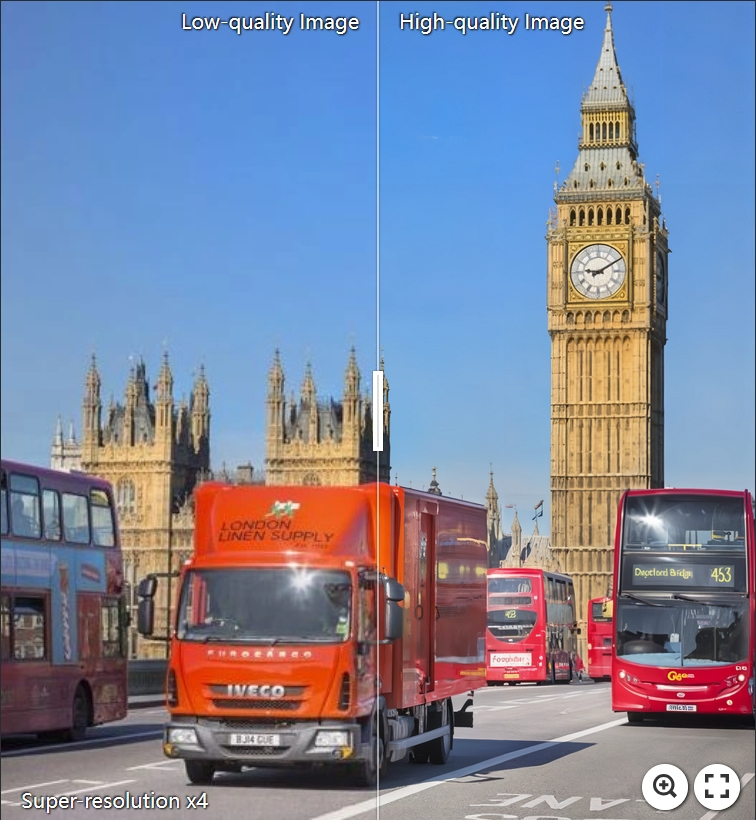](https://imgsli.com/MzYwMDQ3)

[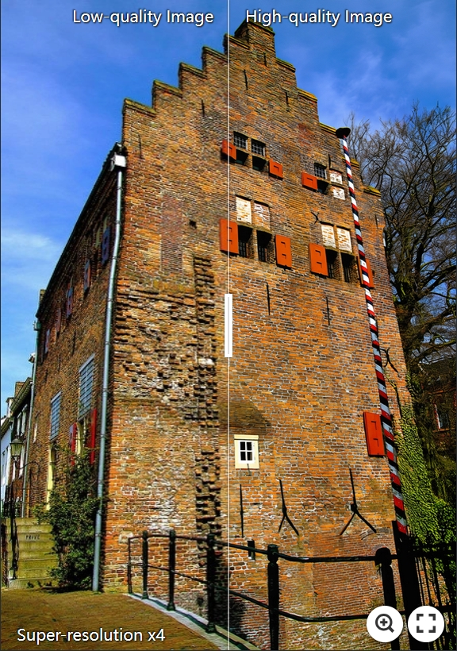](https://imgsli.com/MzUxMTcz) [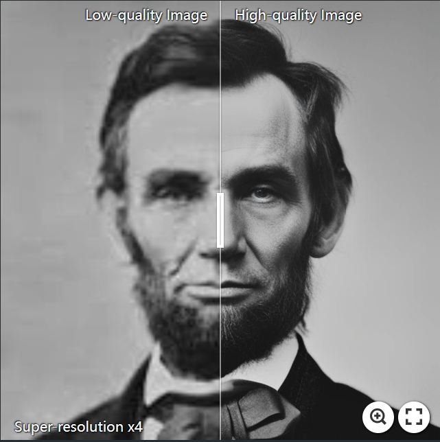](https://imgsli.com/MzQ5OTA2) [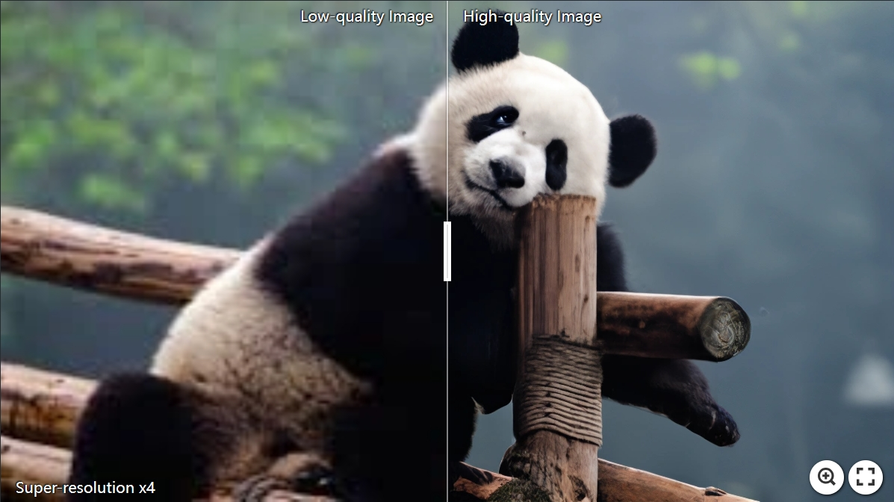](https://imgsli.com/MzYwMDUx) 

### Medical Image Super-Resolution
[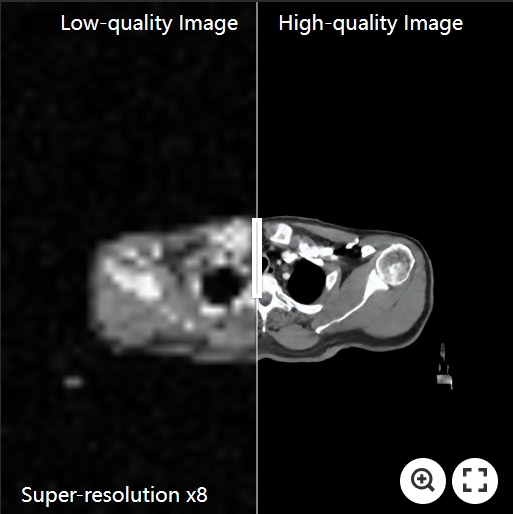](https://imgsli.com/MzYwMDAy) [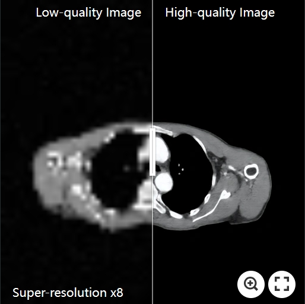](https://imgsli.com/MzYwMDA1) [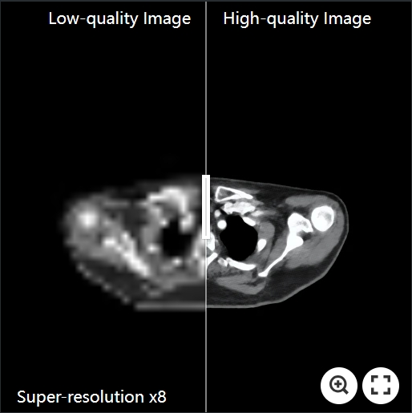](https://imgsli.com/MzYwMDA2) 

# Fast Testing Guide

## Download Pretrained Checkpoints

### First-Stage Models (Autoencoders)
1. ​**Real-world SR Task**: [Download Link]()
2. ​**Medical SR Task**: [Download Link]()
   
​**Note**: Place the downloaded models in the `weights` directory.

### QDM-L Checkpoints
We provide pretrained checkpoints for the QDM-L model for the following tasks:
- [Real-world SR X4]()
- [Medical SR X4]()
- [Medical SR X8]()
  
​**Note**: Ensure all downloaded weights are placed in the `weights` directory.

## Inference

### 🚀 Multi-GPU Acceleration
If you have multiple GPUs available, you can accelerate the inference process using the following command:

```bash
CUDA_VISIBLE_DEVICES=0,1,2,3,4,5,6,7 torchrun --standalone --nproc_per_node=8 --nnodes=1 inference.py \
  -i [Input Directory or Image] \
  -o [Output Dir] \
  --seed [Seed] \
  --chop_bs [Chopping Batch Size] \
  --chop_size [Chopping Size] \
  --cfg_path [Config Path] \
  --ckpt_path [Checkpoint Path] \
  --distributed
```
### 💻 Single-GPU Execution
```bash
python inference.py \
  -i [Input Directory or Image] \
  -o [Output Dir] \
  --seed [Seed] \
  --chop_bs [Chopping Batch Size] \
  --chop_size [Chopping Size] \
  --cfg_path [Config Path] \
  --ckpt_path [Checkpoint Path]
```
### 🔧Configuration Tips
- When processing very large images, you can adjust `--chop_bs` to balance efficiency and memory usage.
- We provide multiple configuration files for different tasks in the `configs/inference` directory. **​Make sure to select the appropriate configuration file for your specific task.**

### Training
#### Preparing stage

## License

This project is licensed under <a rel="license" href="./LICENSE">MIT License</a>. Redistribution and use should follow this license.

## Acknowledgement

This project is primarily based on [ResShift](https://github.com/zsyOAOA/ResShift) and [LDM](https://github.com/CompVis/latent-diffusion). We also adopt [Real-ESRGAN](https://github.com/xinntao/Real-ESRGAN) to synthesize the training data for real-world super-resolution. We design QDM mainly based on [DiT](https://github.com/facebookresearch/DiT). Thanks for their awesome works.

### Contact
If you have any questions, please feel free to contact me via `ydlin718@gmail.com`.
